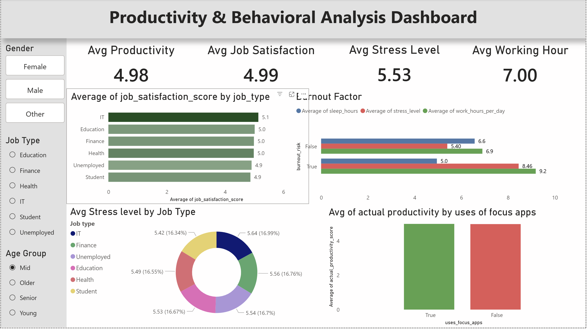

# Productivity & Behavioural Analysis Project
An end-to-end data analysis project using Python and Power BI to explore productivity, stress, burnout, and job satisfaction using behavioural, lifestyle, and demographic data.

## Overview

This project analyses how behavioural, lifestyle, and demographic factors impact **productivity, stress, burnout, and job satisfaction**.

The goal was to go beyond basic analysis and identify **key factors associated with productivity**, while also validating how data preprocessing choices affect insights.

---

## Dataset

* Source: Kaggle (Social Media vs Productivity dataset)
* Records: 30,000 rows
* Features include:

  * Social media usage
  * Work hours
  * Sleep patterns
  * Stress levels
  * Job satisfaction
  * Productivity scores

---

## Tools & Technologies

* **Python** — Pandas, NumPy, Matplotlib
* **Power BI** — Dashboard & visualization
* **Jupyter Notebook** — Data cleaning and analysis
* **GitHub** — Version control and project documentation

---

## Data Cleaning & Processing

* Handled missing values using:

  * Mean imputation
  * Median imputation
  * Dropping null records (for comparison)
* Created new feature columns:

  * `burnout_risk`
  * `high_stress`
  * `low_sleep`
  * `age_group`
* Compared how different cleaning techniques impact correlation results

---

## Analysis Performed

* Descriptive analysis
* Correlation analysis
* Behavioural pattern analysis
* Group-based analysis:
  * Gender
  * Age group
  * Job type
* Burnout and productivity factor analysis

---

## What I Did

* Inspected and prepared a 30,000-row behavioural dataset for analysis
* Evaluated different approaches to handling missing values
* Created derived features for burnout risk, stress, sleep, and age groups
* Performed descriptive and correlation analysis using Python
* Compared productivity patterns across demographic and job-related groups
* Built an interactive Power BI dashboard to communicate key findings
* Validated how preprocessing decisions affected analytical results

---

## Key Insights

* Job satisfaction shows the strongest correlation with productivity among the analysed variables.
* Higher stress, longer working hours, and lower sleep levels are associated with higher burnout risk.
* Social media usage shows a weaker relationship with productivity than initially expected.
* Age and gender show relatively limited variation in the analysed productivity patterns.
* Different missing-value handling approaches can materially affect correlation results and analytical conclusions.

---

## Power BI Dashboard

The interactive dashboard includes:

* KPI cards (Productivity, Stress, Job Satisfaction, Work Hours)
* Job-wise comparison charts
* Burnout factor analysis
* Focus apps vs productivity comparison
* Slicers for:

  * Gender
  * Job Type
  * Age Group

## Dashboard Preview


---

## Key Learning

A critical insight from this project:

> The choice of missing value handling method (mean vs dropping data) can significantly alter correlations and conclusions.

---

## Project Structure

```
data/
  ├── cleaned_productivity_data.csv
  ├── social_media_vs_productivity.csv

notebook/
  ├── Productivity_Analysis.ipynb

dashboard/
  ├── Productivity_Dashboard.pbix
```

---

## Conclusion

Productivity shows stronger associations with **job satisfaction and work-related factors** than with direct behavioural factors like screen time.

This project highlights the importance of:

* Thoughtful data preprocessing
* Validating assumptions
* Combining analysis with visualisation for better decision-making

---

## 👤 Author

**Deepika Chauthani**
Data Engineer | SQL | ETL | Python | Power BI | Tableau
